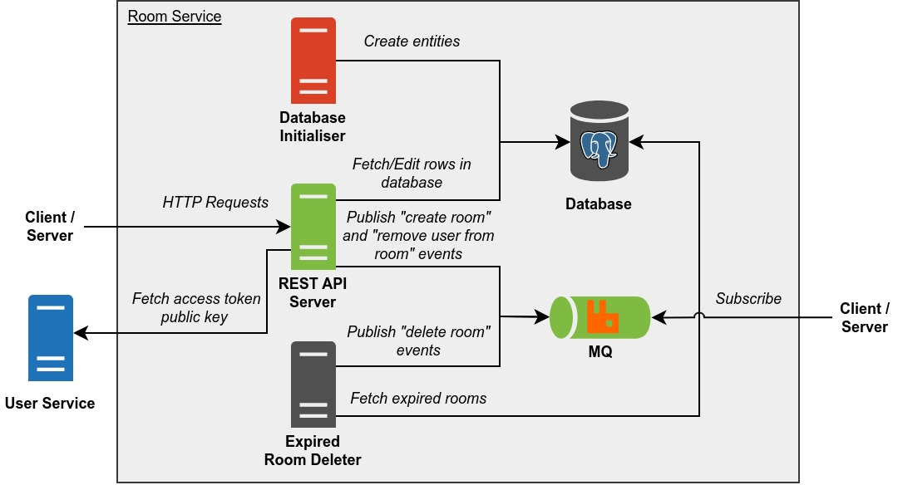

# PeerPrep Room Service

Manages rooms. Rooms represent user matchings and contains information about said matching such as question assigned and programming language chosen.

Note that Room Service does not match users together. Said task is handled by Matching Service.

## Table of Contents

- [Build Script](#build-script)
- [Architecture](#architecture)
- [Docker Images](#docker-images)
  - [API](#api)
  - [Database Initialiser](#database-initialiser)
  - [Expired Room Deleter](#expired-room-deleter)
- [Deployment](#deployment)
  - [Kubernetes Deployment](#kubernetes-deployment)
  - [Docker Compose Deployment](#docker-compose-deployment)
- [REST API](#rest-api)
  - [Create a Room](#create-a-room)
  - [Get a Room by Room ID](#get-a-room-by-room-id)
  - [Get a Room by User ID](#get-a-room-by-user-id)
  - [Extend the Lifespan of a Room](#extend-the-lifespan-of-a-room)
  - [Remove a User from a Room](#remove-a-user-from-a-room)
  - [Delete a Room](#delete-a-room)
- [MQ Events](#mq-events)
  - [Create Room](#create-room)
  - [Delete Room](#delete-room)
  - [Remove User from Room](#remove-user-from-room)

## Build Script

`build_images.sh` is a build script for building the Docker images and optionally pushing them to the container registry. To get more information about the script, run:

```
./build_images.sh -h
```

## Architecture



Legend:

- Start of arrow indicates request origin and end of arrow indicates request destination.
- `#505050` Dark grey items represents internal servers/containers.
- `#DA4026` Red items represents internal servers/containers that are temporary.
- `#7FBA42` Green items represents internal servers/containers that are exposed.
- `#2072B8` Blue items represents external servers/containers.

**REST API Server**

- Handles REST API requests.
- Can be scaled horizontally.
- Corresponds to the [API](#api) docker image.

**Database Initialiser**

- Creates entities in the database.
- Does nothing if the database already contains one or more entities it intends to create (behaviour can be changed via environment variables).
- Shuts down once it is done initialising the database.
- Corresponds to the [Database Initialiser](#database-initialiser) docker image.

**Expired Room Deleter**

- Periodically deletes all expired rooms from the database.
- Corresponds to the [Expired Room Deleter](#expired-room-deleter) docker image.

**Database**

- Database for storing room information.

**Message Broker**

- Message broker for publishing room events.

## Docker Images

### API

**Name:** ghcr.io/cs3219-ay2324s1-g04/peerprep_room_service_api

**Description:** Runs the REST API.

**Environment Variables:**

- `DATABASE_USER` - User on the database host.
- `DATABASE_PASSWORD` - Password of the database.
- `DATABASE_HOST` - Address of the database host.
- `DATABASE_PORT` - Port the database is listening on.
- `DATABASE_SHOULD_USE_TLS` - Should database connection be secured with TLS. Set to "true" to enable.
- `DATABASE_NAME` - Name of the database.
- `DATABASE_CONNECTION_TIMEOUT_MILLIS` - Number of milliseconds for a database client to connect to the database before timing out.
- `DATABASE_MAX_CLIENT_COUNT` - Max number of database clients.
- `MQ_USER` - User on the MQ host.
- `MQ_PASSWORD` - Password of the MQ.
- `MQ_HOST` - Address of the MQ host.
- `MQ_PORT` - Port the MQ is listening on.
- `MQ_VHOST` - Vhost of the MQ.
- `MQ_SHOULD_USE_TLS` - Should MQ connection be secured with TLS. Set to "true" to enable.
- `MQ_EXCHANGE_NAME` - Name of the MQ exchange.
- `USER_SERVICE_HOST` - Address of the User Service host.
- `USER_SERVICE_PORT` - Port the User Service is listening on.
- `ROOM_EXPIRE_MILLIS` - Number of milliseconds a room can live for since the last expiry date and time extension.
- `PORT` - Port to listen on.
- `NODE_ENV` - Mode the app is running on ("development" or "production"). "development" mode enables features such as CORS for "localhost".

### Database Initialiser

**Name:** ghcr.io/cs3219-ay2324s1-g04/peerprep_room_service_database_initialiser

**Description:** Initialises the database by creating the necessary entities.

**Environment Variables:**

- `DATABASE_USER` - User on the database host.
- `DATABASE_PASSWORD` - Password of the database.
- `DATABASE_HOST` - Address of the database host.
- `DATABASE_PORT` - Port the database is listening on.
- `DATABASE_SHOULD_USE_TLS` - Should database connection be secured with TLS. Set to "true" to enable.
- `DATABASE_NAME` - Name of the database.
- `DATABASE_CONNECTION_TIMEOUT_MILLIS` - Number of milliseconds for a database client to connect to the database before timing out.
- `DATABASE_MAX_CLIENT_COUNT` - Max number of database clients.
- `SHOULD_FORCE_INITIALISATION` - Should database initialisation be done regardless of whether one or more entities to be created already exist. Set to "true" to enable (may cause data loss).

### Expired Room Deleter

**Name:** ghcr.io/cs3219-ay2324s1-g04/peerprep_room_service_expired_room_deleter

**Description:** Periodically deletes expired rooms from the database and publishes the appropriate event on the MQ.

**Environment Variables:**

- `DATABASE_USER` - User on the database host.
- `DATABASE_PASSWORD` - Password of the database.
- `DATABASE_HOST` - Address of the database host.
- `DATABASE_PORT` - Port the database is listening on.
- `DATABASE_SHOULD_USE_TLS` - Should database connection be secured with TLS. Set to "true" to enable.
- `DATABASE_NAME` - Name of the database.
- `DATABASE_CONNECTION_TIMEOUT_MILLIS` - Number of milliseconds for a database client to connect to the database before timing out.
- `DATABASE_MAX_CLIENT_COUNT` - Max number of database clients.
- `MQ_USER` - User on the MQ host.
- `MQ_PASSWORD` - Password of the MQ.
- `MQ_HOST` - Address of the MQ host.
- `MQ_PORT` - Port the MQ is listening on.
- `MQ_VHOST` - Vhost of the MQ.
- `MQ_SHOULD_USE_TLS` - Should MQ connection be secured with TLS. Set to "true" to enable.
- `MQ_EXCHANGE_NAME` - Name of the MQ exchange.
- `ROOM_DELETION_INTERVAL_MILLIS` - Number of milliseconds between database searches for expired rooms.

## Deployment

### Kubernetes Deployment

This is the main deployment method for production.

**Note:**

- The database and message broker are hosted externally, not within the Kubernetes cluster.

**Prerequisite**

- Docker images must be pushed to the container registry and made public.
  - To push to the container registry (assuming one has the necessary permissions), run: `./build_images.sh -p`
  - To make the images public, change the visibility of the image on [GitHub](https://github.com/orgs/CS3219-AY2324S1-G04/packages).
- Kubernetes cluster must be setup as specified in the [main repository](https://github.com/CS3219-AY2324S1/ay2324s1-course-assessment-g04#deployment).
- User Service must be deployed within the Kubernetes cluster.

**Steps:**

1. Ensure the "peerprep" namespace has been created: `kubectl create namespace peerprep`
2. Navigate to the "kubernetes" directory: `cd kubernetes`
3. Deploy the Kubernetes objects: `./deploy.sh`
    - To delete the Kubernetes objects, run: `./delete.sh`

### Docker Compose Deployment

This is intended for development use only. It is meant to make developing other services easier.

**Note:**

- No horizontal auto scaling is provided.
- The database is created by Docker compose and data is not backed up.
- The message broker is created by Docker compose and data is not backed up.

**Prerequisite**

- Docker images must be built.
  - To build the images, run: `./build_images.sh`
- User Service must be deployed via Docker compose.

**Steps:**

1. Ensure that the "peerprep" network exist: `docker network create -d bridge peerprep`
2. Create the docker containers: `docker compose up`
    - To delete the docker containers, run: `docker compose down`

## REST API

### Create a Room

> [POST] `/room-service/rooms`

Creates a new room.

WARNING: This endpoint is potentially abusable. It should be inaccessible by the frontend.

**Body**

The body must be of JSON format, containing the following fields:

- `user-ids` - Array of user IDs which corresponds to the users in the room.
- `question-id` - ID of the question assigned to the room.
- `question-lang-slug` - Language slug of the programming language chosen for the room.

Example request body:

```json
{
  "user-ids": [1, 2],
  "question-id": "5241ec50-b884-4278-98cf-4c91519eaad5",
  "question-lang-slug": "typescript"
}
```

**Response**

- `201` - Room created. The response body contains the ID of the room.
  - Example response body:
    ```json
    { "room-id": "bb9d89c6-7b02-448d-9948-79ff753d73bd" }
    ```
- `400` - Body is not a valid JSON object or one or more parameter are invalid. The reason for the error is provided in the response body.
  - Example response body:
    ```json
    {
      "user-ids": "User ID must be an integer.",
      "question-id": "Question ID cannot be empty.",
      "question-lang-slug": "Question language slug cannot be empty."
    }
    ```
- `500` - Unexpected error occurred on the server.

### Get a Room by Room ID

> [GET] `/room-service/rooms/:room-id`

Gets information about the room whose room ID was specified.

**Path Parameters**

- `room-id` - Room ID.

**Response**

- `200` - Success. The response will contain information about the room.
  - Example response body:
    ```json
    {
      "room-id": "bb9d89c6-7b02-448d-9948-79ff753d73bd",
      "user-ids": [1, 2],
      "question-id": "5241ec50-b884-4278-98cf-4c91519eaad5",
      "question-lang-slug": "typescript",
      "expire-at": "2023-11-04T03:03:49.692Z"
    }
    ```
- `400` - One or more path parameters are invalid. The reason for the error is provided in the response body.
  - Example response body:
    ```json
    { "room-id": "Room ID cannot be empty." }
    ```
- `404` - No room was found that has the specified room ID.
- `500` - Unexpected error occurred on the server.

### Get a Room by User ID

> [GET] `/room-service/room`

Gets information about the room which contains the user who owns the specified access token.

**Cookies**

- `access-token` - Access token.

**Response**

- `200` - Success. The response will contain information about the room.
  - Example response body:
    ```json
    {
      "room-id": "bb9d89c6-7b02-448d-9948-79ff753d73bd",
      "user-ids": [1, 2],
      "question-id": "5241ec50-b884-4278-98cf-4c91519eaad5",
      "question-lang-slug": "typescript",
      "expire-at": "2023-11-04T03:03:49.692Z"
    }
    ```
- `401` - Access token was not provided or is invalid.
- `404` - User who owns the access token does not belong in any room.
- `500` - Unexpected error occurred on the server.

### Extend the Lifespan of a Room

> [PATCH] `/room-service/room/keep-alive`

Extends the lifespan of the room which contains the user who owns the specified access token.

**Cookies**

- `access-token` - Access token.

**Response**

- `200` - Success. The response will contain the updated expiry of the room.
  - Example response body:
    ```json
    { "expire-at": "2023-11-04T03:03:49.692Z" }
    ```
- `401` - Access token was not provided or is invalid.
- `404` - User who owns the access token does not belong in any room.
- `500` - Unexpected error occurred on the server.

### Remove a User from a Room

> [DELETE] `/room-service/room/user`

Removes the user who owns the specified access token from the room said user is in.

**Cookies**

- `access-token` - Access token.

**Response**

- `200` - Success.
- `401` - Access token was not provided or is invalid.
- `404` - User who owns the access token does not belong in any room.
- `500` - Unexpected error occurred on the server.

### Delete a Room

> [DELETE] `/room-service/rooms/:room-id`

Deletes the room whose room ID was specified.

WARNING: This endpoint is only available during development. It will not be accessible during production.

**Path Parameters**

- `room-id` - ID of the room.

**Response**

- `200` - Success.
- `400` - One or more path parameters are invalid. The reason for the error is provided in the response body.
  - Example response body:
    ```json
    { "room-id": "Room ID cannot be empty." }
    ```
- `404` - No room was found that has the specified room ID.
- `500` - Unexpected error occurred on the server.

## MQ Events

Room Service utilises an MQ that support AMQP. Events are published to a fanout exchange which services may bind queues to in order to obtain information about changes made to a room.

Each event message uses the JSON format. The message contains an `event-type` field which describes the type of event and additional fields which stores information about said event.

This section describes these events.

### Create Room

> `create`

Published when a room is created.

The message contains the information about the room that was created.

**Example:**

```json
{
  "event-type": "create",
  "room": {
    "room-id": "bb9d89c6-7b02-448d-9948-79ff753d73bd",
    "user-ids": [1, 2],
    "question-id": "5241ec50-b884-4278-98cf-4c91519eaad5",
    "question-lang-slug": "typescript",
  }
}
```

### Delete Room

> `delete`

Published when a room is deleted.

The message contains the information about the room that was deleted.

**Example:**

```json
{
  "event-type": "delete",
  "room": {
    "room-id": "bb9d89c6-7b02-448d-9948-79ff753d73bd",
    "user-ids": [2],
    "question-id": "5241ec50-b884-4278-98cf-4c91519eaad5",
    "question-lang-slug": "typescript",
  }
}
```

### Remove User from Room

> `remove-user`

Published when a user leaves a room.

The message contains the information about the updated room as well as the user ID of the user that was removed.

**Example:**

```json
{
  "event-type": "remove-user",
  "room": {
    "room-id": "bb9d89c6-7b02-448d-9948-79ff753d73bd",
    "user-ids": [2],
    "question-id": "5241ec50-b884-4278-98cf-4c91519eaad5",
    "question-lang-slug": "typescript",
  },
  "removed-user-id": 1
}
```
